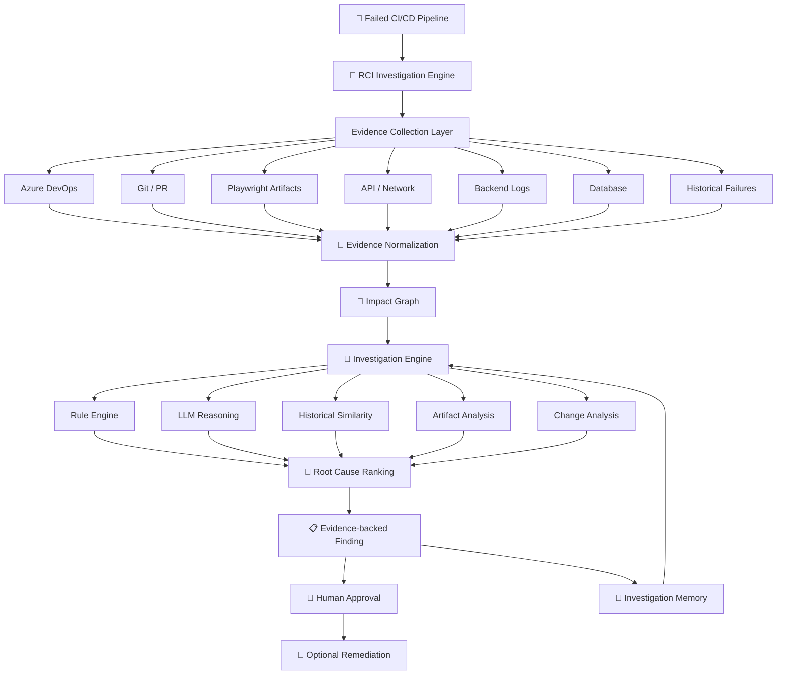
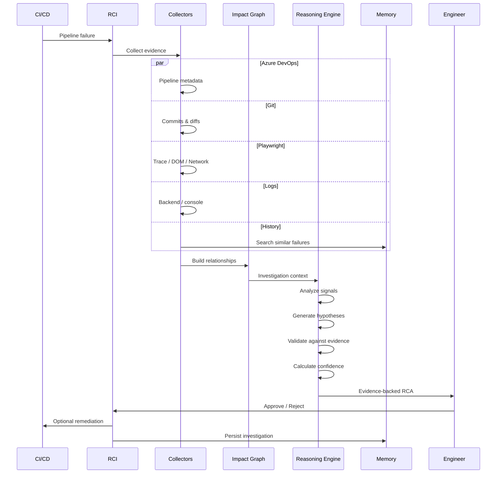
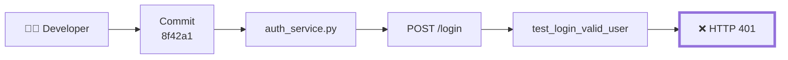
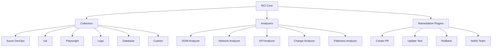
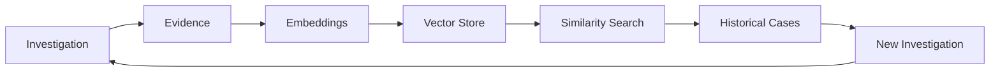
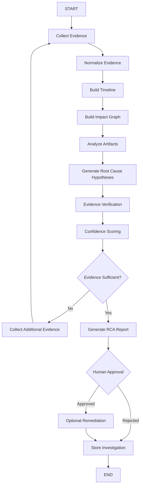
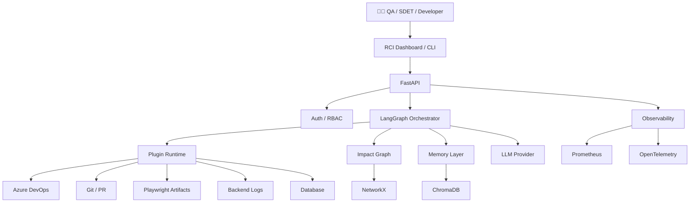

# 🔎 AI Root Cause Investigator (RCI)


### **An Evidence-Driven AI Quality Operating System for Autonomous Root Cause Investigation**

> **When a test fails, don't just report the failure. Investigate why it failed.**

AI Root Cause Investigator (**RCI**) is an enterprise-grade, framework-agnostic **AI Quality Operating System** that investigates failed automation pipelines like a senior QA/SDET engineer with years of debugging experience.

Instead of forcing engineers to manually jump between CI/CD, Git, PRs, Playwright traces, screenshots, videos, browser logs, APIs, backend logs, databases, and historical failures, RCI builds a **single evidence graph** and determines the most probable root cause.

### 🎯 Core Promise


```text
Pipeline Failure
       │
       ▼
┌──────────────────────┐
│   RCI Investigation  │
└──────────┬───────────┘
           │
           ▼
   Collect Evidence
           │
           ▼
   Correlate Signals
           │
           ▼
    Build Impact Graph
           │
           ▼
   Analyze Failure
           │
           ▼
  Rank Root Causes
           │
           ▼
 Evidence + Confidence
           │
           ▼
 Human Approval
           │
           ▼
 Optional Remediation
```

**Investigation target: < 2 minutes**

---

## 🚀 Why RCI?

Traditional test automation tells you:

> ❌ `TestLogin failed`

RCI tries to tell you:

> ✅ `TestLogin failed because commit 8f42a1 changed the authentication API response from HTTP 200 → HTTP 401. The failing request occurred 1.7s after the deployment. The Playwright trace confirms the login page received an unauthorized response, while the database and browser environment remained healthy. Confidence: 94%.`

The difference is **investigation**.

---

# 🧠 What RCI Investigates

RCI correlates evidence across the entire engineering ecosystem.

| Evidence Source        | What RCI Investigates                         |
| ---------------------- | --------------------------------------------- |
| 🟦 Azure DevOps        | Pipeline, build, stages, jobs, deployments    |
| 🔀 Git                 | Commits, branches, diffs, authors             |
| 🔗 Pull Requests       | Changed files, reviewers, PR history          |
| 🎭 Playwright          | Trace, screenshot, video, DOM, locator        |
| 🌐 Network             | Requests, responses, status codes, timing     |
| 🖥️ Browser Console    | Errors, warnings, uncaught exceptions         |
| 🔌 APIs                | Contract changes, payloads, response codes    |
| 🧾 Backend Logs        | Exceptions, stack traces, service failures    |
| 🗄️ Database           | State changes, query failures, data anomalies |
| 📚 Historical Failures | Similar incidents and previous resolutions    |
| 🌍 Environment         | Browser, OS, configuration, dependencies      |
| 📊 Observability       | Metrics, traces, logs and health signals      |

---

# 🏗️ System Architecture



---

# 🧩 RCI Architecture Layers

RCI is intentionally designed as a **Quality Operating System**, not just another AI chatbot.

```text
┌─────────────────────────────────────────────────────────────┐
│                    RCI QUALITY OS                           │
├─────────────────────────────────────────────────────────────┤
│                                                             │
│  🖥️ Experience Layer                                       │
│  CLI • REST API • Dashboard • Teams • Slack                │
│                                                             │
├─────────────────────────────────────────────────────────────┤
│                                                             │
│  🧠 Intelligence Layer                                     │
│  RCA • Reasoning • Ranking • Similarity • Confidence       │
│                                                             │
├─────────────────────────────────────────────────────────────┤
│                                                             │
│  🔗 Correlation Layer                                       │
│  Impact Graph • Timeline • Change Mapping • Dependencies   │
│                                                             │
├─────────────────────────────────────────────────────────────┤
│                                                             │
│  🔬 Analysis Layer                                          │
│  DOM • Trace • Network • Console • API • Logs • DB         │
│                                                             │
├─────────────────────────────────────────────────────────────┤
│                                                             │
│  📥 Evidence Layer                                          │
│  ADO • Git • PR • Playwright • Logs • History              │
│                                                             │
├─────────────────────────────────────────────────────────────┤
│                                                             │
│  🔌 Plugin Layer                                            │
│  Collectors • Analyzers • Remediation • Integrations       │
│                                                             │
├─────────────────────────────────────────────────────────────┤
│                                                             │
│  🔐 Enterprise Foundation                                   │
│  Auth • Secrets • Audit • RBAC • Observability             │
│                                                             │
└─────────────────────────────────────────────────────────────┘
```

---

# ⚡ Investigation Lifecycle



---

# 🔬 The Investigation Model

RCI does **not** immediately ask an LLM:

> "Why did this test fail?"

Instead, it follows a controlled investigation process.

```text
                 FAILURE
                    │
                    ▼
          ┌──────────────────┐
          │ Establish Scope  │
          └────────┬─────────┘
                   ▼
          ┌──────────────────┐
          │ Gather Evidence │
          └────────┬─────────┘
                   ▼
          ┌──────────────────┐
          │ Build Timeline   │
          └────────┬─────────┘
                   ▼
          ┌──────────────────┐
          │ Detect Changes   │
          └────────┬─────────┘
                   ▼
          ┌──────────────────┐
          │ Build Graph      │
          └────────┬─────────┘
                   ▼
          ┌──────────────────┐
          │ Generate Causes  │
          └────────┬─────────┘
                   ▼
          ┌──────────────────┐
          │ Verify Evidence  │
          └────────┬─────────┘
                   ▼
          ┌──────────────────┐
          │ Score Confidence │
          └────────┬─────────┘
                   ▼
          ┌──────────────────┐
          │ Human Approval   │
          └──────────────────┘
```

---

# 🕸️ Impact Graph

One of RCI's core capabilities is the **Impact Graph**.

Instead of looking at a test failure in isolation, RCI connects:

```text
Developer
    │
    ▼
Commit
    │
    ▼
Changed File
    │
    ▼
Module
    │
    ▼
API / Component
    │
    ▼
Test
    │
    ▼
Failure
```

Example:



This allows RCI to answer:

* What changed?
* Who changed it?
* Which tests depend on it?
* Which modules are affected?
* Did the failure appear immediately after the change?
* Has this change caused a similar failure before?

---

# 🧠 Evidence-First AI

RCI follows one fundamental rule:

> **No evidence → No conclusion.**

The reasoning engine separates:

### Evidence

```text
HTTP 401 observed
Commit changed authentication middleware
Failure started after deployment
Trace confirms unauthorized response
```

### Hypothesis

```text
Authentication middleware may be rejecting valid credentials.
```

### Verified Finding

```text
Authentication middleware changed in commit 8f42a1.
The same deployment introduced HTTP 401 responses for valid
credentials.

Confidence: 94%
```

---

# 🎯 Confidence Scoring

RCI doesn't simply return:

```text
Root cause: authentication issue
```

It returns a ranked investigation result.

```text
┌───────────────────────────────────────────────────────┐
│ ROOT CAUSE #1                                         │
│                                                       │
│ Authentication middleware regression                  │
│                                                       │
│ Confidence                 94%                        │
│ Evidence Strength         VERY HIGH                   │
│                                                       │
│ Changed Component         auth_service.py             │
│ Related Commit             8f42a1                      │
│ Affected Test              test_login_valid_user      │
│                                                       │
│ Evidence                   7                         │
│ ├─ HTTP 401               ✓                           │
│ ├─ Code diff              ✓                           │
│ ├─ Playwright trace       ✓                           │
│ ├─ Deployment timeline    ✓                           │
│ ├─ Historical match       ✓                           │
│ └─ Environment health     ✓                           │
│                                                       │
│ Suggested Action: Review authentication middleware    │
└───────────────────────────────────────────────────────┘
```

### Example ranking

| Rank | Root Cause                           | Confidence | Evidence |
| ---: | ------------------------------------ | ---------: | -------: |
| 🥇 1 | Authentication middleware regression |        94% |        7 |
| 🥈 2 | API contract mismatch                |        71% |        4 |
| 🥉 3 | Environment instability              |        18% |        2 |

---

# 🧪 Playwright Intelligence

RCI is **Playwright-first**, while keeping the core framework-agnostic.

It can analyze:

```text
Playwright
├── Trace
│   ├── Actions
│   ├── DOM snapshots
│   ├── Network
│   └── Timing
│
├── Screenshots
│
├── Videos
│
├── Console
│   ├── Errors
│   └── Warnings
│
├── Network
│   ├── Requests
│   ├── Responses
│   ├── Status Codes
│   └── Timing
│
└── Locators
    ├── Selector changes
    ├── DOM changes
    └── Element visibility
```

### Example

```text
Expected:

button[data-testid="login"]

Actual DOM:

button[data-testid="sign-in"]
```

RCI can correlate:

```text
DOM change
      +
Locator failure
      +
Recent frontend commit
      +
Same failure never occurred before
      ↓
Likely locator regression
```

---

# 🔌 Plugin Architecture

RCI is designed around plugins rather than hard-coded integrations.



### Collector Example

```python
from src.plugins.base import BaseCollector, EvidenceBundle


class MyCollector(BaseCollector):
    name = "my_source"

    async def collect(
        self,
        context: InvestigationContext
    ) -> EvidenceBundle:
        ...
```

Register through:

```yaml
plugins:
  collectors:
    - azure_devops
    - git
    - playwright
    - backend_logs
    - database
    - my_source
```

---

# 🧠 Memory Architecture

RCI becomes more useful as investigations accumulate.



### Memory stores

* Previous root causes
* Failure signatures
* Resolved incidents
* Similar stack traces
* Similar DOM failures
* Known flaky tests
* Historical commits
* Remediation outcomes
* Engineer-approved findings

Supported storage can include:

```text
ChromaDB
Pinecone
Weaviate
```

---

# 🤖 LangGraph Investigation Engine

LangGraph provides the orchestration layer for deterministic and auditable investigations.



---

# 👤 Human-in-the-Loop

RCI is **not designed to blindly modify production systems**.

The default model is:

```text
AI investigates
      ↓
AI explains
      ↓
AI proposes
      ↓
Human reviews
      ↓
Human approves
      ↓
Action executes
```

This provides a safe boundary between:

**AI reasoning → Engineering decision → Automated action**

---

# 🛡️ Enterprise Security

Security is part of the architecture rather than an afterthought.

```text
┌───────────────────────────────────────────────┐
│                 API Gateway                   │
├───────────────────────────────────────────────┤
│ JWT Authentication                            │
│ RBAC / Scopes                                 │
├───────────────────────────────────────────────┤
│ Investigation API                             │
├───────────────────────────────────────────────┤
│ Plugin Sandbox                                │
├───────────────────────────────────────────────┤
│ Least Privilege Credentials                   │
├───────────────────────────────────────────────┤
│ Audit Logging                                 │
├───────────────────────────────────────────────┤
│ Secret Manager                                │
│ Azure Key Vault / HashiCorp Vault             │
└───────────────────────────────────────────────┘
```

### Security principles

* 🔐 No secrets in source code
* 🔑 Environment-based credentials
* 🏦 Azure Key Vault / HashiCorp Vault support
* 👤 JWT authentication
* 🛂 Role-based access control
* 📜 Immutable audit trail
* 🔒 Least-privilege plugins
* 🧱 Optional plugin sandboxing
* 🗃️ Configurable data retention
* 🔍 Investigation traceability

---

# 📊 Observability

RCI observes itself.

### Telemetry

```text
Application
    │
    ├── Structured Logs
    │      └── structlog
    │
    ├── Metrics
    │      └── Prometheus
    │
    └── Traces
           └── OpenTelemetry
```

Important metrics include:

| Metric                   | Purpose                    |
| ------------------------ | -------------------------- |
| Investigation Duration   | Track <2 min target        |
| Evidence Collection Time | Identify slow integrations |
| RCA Confidence           | Measure reasoning quality  |
| Evidence Count           | Track investigation depth  |
| False RCA Rate           | Measure accuracy           |
| Human Approval Rate      | Measure trust              |
| Remediation Success Rate | Measure automation quality |
| Historical Match Rate    | Measure memory usefulness  |

---

# 🖥️ Deployment Architecture



---

# 📦 Technology Stack

| Layer                | Technology                        |
| -------------------- | --------------------------------- |
| Language             | Python 3.11+                      |
| API                  | FastAPI                           |
| Orchestration        | LangGraph                         |
| Graph Intelligence   | NetworkX                          |
| Vector Memory        | ChromaDB                          |
| Embeddings           | Configurable embedding provider   |
| Browser Intelligence | Playwright                        |
| Testing              | Pytest                            |
| Logging              | Structlog                         |
| Metrics              | Prometheus                        |
| Tracing              | OpenTelemetry                     |
| Authentication       | JWT                               |
| Containers           | Docker                            |
| CI/CD                | Azure DevOps                      |
| Secrets              | Azure Key Vault / HashiCorp Vault |

---

# ⚡ Quick Start

## 1. Clone

```bash
git clone <repository-url>

cd ai-root-cause-investigator
```

## 2. Create environment

```bash
python -m venv .venv
```

### Linux / macOS

```bash
source .venv/bin/activate
```

### Windows

```powershell
.venv\Scripts\activate
```

## 3. Install

```bash
pip install -e ".[dev]"
```

## 4. Configure

```bash
cp .env.example .env
```

Configure:

```env
AZURE_DEVOPS_PAT=
AZURE_DEVOPS_ORG=
AZURE_DEVOPS_PROJECT=

GIT_TOKEN=

OPENAI_API_KEY=
ANTHROPIC_API_KEY=

CHROMA_HOST=
CHROMA_PORT=

JWT_SECRET=
```

## 5. Run investigation

```bash
rci investigate \
  --pipeline-id 12345 \
  --run-id 67890 \
  --project MyProject \
  --org https://dev.azure.com/myorg
```

## 6. Start API

```bash
rci-api
```

API documentation:

```text
http://localhost:8000/docs
```

## 7. Docker

```bash
docker compose up --build
```

---

# 🧪 Example Investigation

### Input

```text
Pipeline: #67890
Test: test_checkout_payment
Status: FAILED
```

### RCI discovers

```text
❌ UI Assertion Failed

        ↓

POST /api/payment → HTTP 500

        ↓

Backend:
PaymentService NullPointerException

        ↓

Git:
payment_service.py changed 23 minutes ago

        ↓

PR:
PR #842

        ↓

Historical Memory:
Similar failure occurred twice after the same code path changed
```

### Final RCA

```text
━━━━━━━━━━━━━━━━━━━━━━━━━━━━━━━━━━━━━━━━━━
ROOT CAUSE INVESTIGATION
━━━━━━━━━━━━━━━━━━━━━━━━━━━━━━━━━━━━━━━━━━

Root Cause:
PaymentService regression

Confidence:
96%

Severity:
HIGH

Affected Module:
payment_service

Related Commit:
8f42a1

Evidence:
✓ HTTP 500 response
✓ Backend exception
✓ Code diff
✓ Deployment timeline
✓ Playwright trace
✓ Historical similarity

Recommended Action:
Review null handling introduced in payment_service.py

Human Approval:
REQUIRED
━━━━━━━━━━━━━━━━━━━━━━━━━━━━━━━━━━━━━━━━━━
```

---

# 🧭 Failure Classification

RCI can classify failures into categories such as:

```text
┌──────────────────────────────┐
│ Failure Classification       │
├──────────────────────────────┤
│                              │
│ 🐛 Code Regression            │
│ 🔌 API Contract Change        │
│ 🎭 Locator / DOM Change       │
│ ⏱️ Timeout                    │
│ 🌐 Network Failure            │
│ 🖥️ Environment Issue          │
│ 🧪 Test Defect                │
│ 🎲 Flaky Test                 │
│ 🗄️ Database Issue             │
│ 🔐 Authentication             │
│ ⚙️ Configuration              │
│ 📦 Dependency Regression      │
│ 🚀 Deployment Issue           │
│                              │
└──────────────────────────────┘
```

---

# 🧩 Framework-Agnostic Design

Although Playwright is the first-class adapter, the RCI core does not depend on a single automation framework.

```text
                 RCI CORE
                    │
       ┌────────────┼────────────┐
       │            │            │
   Playwright   Selenium     Cypress
       │            │            │
       └────────────┼────────────┘
                    │
              Evidence Model
```

Future adapters can support:

* Playwright
* Selenium
* Cypress
* Appium
* REST API testing
* Pytest
* JUnit
* Jest
* Postman/Newman
* Custom enterprise frameworks

---

# 🗂️ Recommended Project Structure

```text
ai-root-cause-investigator/
│
├── src/
│   ├── api/
│   │   ├── routes/
│   │   ├── middleware/
│   │   └── schemas/
│   │
│   ├── core/
│   │   ├── config.py
│   │   ├── context.py
│   │   ├── evidence.py
│   │   └── findings.py
│   │
│   ├── graph/
│   │   ├── impact_graph.py
│   │   ├── nodes.py
│   │   └── relationships.py
│   │
│   ├── investigation/
│   │   ├── graph.py
│   │   ├── orchestrator.py
│   │   ├── ranking.py
│   │   └── confidence.py
│   │
│   ├── memory/
│   │   ├── embeddings.py
│   │   ├── store.py
│   │   └── retrieval.py
│   │
│   ├── plugins/
│   │   ├── base.py
│   │   ├── collectors/
│   │   ├── analyzers/
│   │   └── remediation/
│   │
│   ├── integrations/
│   │   ├── azure_devops/
│   │   ├── git/
│   │   ├── playwright/
│   │   ├── logs/
│   │   └── database/
│   │
│   └── observability/
│       ├── logging.py
│       ├── metrics.py
│       └── tracing.py
│
├── configs/
│   ├── plugins.yaml
│   └── settings.yaml
│
├── tests/
│   ├── unit/
│   ├── integration/
│   └── evaluation/
│
├── docker/
├── docs/
├── scripts/
│
├── .env.example
├── docker-compose.yml
├── pyproject.toml
└── README.md
```

---

# 📈 Quality Evaluation

RCI should evaluate itself like an AI product.

### Core evaluation metrics

```text
                 RCI QUALITY SCORE
                        │
        ┌───────────────┼───────────────┐
        ▼               ▼               ▼
   RCA Accuracy    Evidence Quality   Speed
        │               │               │
        ▼               ▼               ▼
   Precision       Grounding        < 2 min
   Recall          Completeness
   F1               Traceability
```

### Recommended metrics

| Metric                     |  Target |
| -------------------------- | ------: |
| Root Cause Precision       |   ≥ 90% |
| Evidence Grounding         |   ≥ 95% |
| Investigation Completion   |   ≥ 95% |
| Median Investigation Time  | < 2 min |
| False Positive RCA         |   < 10% |
| Human Approval Rate        |   > 85% |
| Historical Match Precision |   ≥ 85% |
| Remediation Success        |   ≥ 90% |

> These are engineering targets, not claims about current system performance.

---

# 🛣️ Roadmap

## Phase 1 — Foundation

* [ ] Evidence model
* [ ] Plugin architecture
* [ ] Azure DevOps collector
* [ ] Git collector
* [ ] Playwright artifact collector
* [ ] Basic RCA engine
* [ ] CLI

## Phase 2 — Intelligence

* [ ] Impact Graph
* [ ] LangGraph orchestration
* [ ] Confidence scoring
* [ ] Historical similarity
* [ ] DOM intelligence
* [ ] Network intelligence
* [ ] Flakiness detection

## Phase 3 — Enterprise

* [ ] FastAPI platform
* [ ] JWT / RBAC
* [ ] Audit logging
* [ ] Secret management
* [ ] Prometheus
* [ ] OpenTelemetry
* [ ] Multi-project support

## Phase 4 — Autonomous Quality Engineering

* [ ] Autonomous investigation planning
* [ ] Automated fix generation
* [ ] Pull Request creation
* [ ] Test repair
* [ ] Regression prediction
* [ ] Release risk scoring
* [ ] Autonomous remediation with approval gates

---

# 🔮 Future Vision

RCI is intended to evolve from:

```text
Failure Analyzer
       ↓
Root Cause Investigator
       ↓
AI QA Engineer
       ↓
Quality Engineering Operating System
```

The long-term goal is a system that understands:

```text
Requirements
     ↓
Code
     ↓
Tests
     ↓
CI/CD
     ↓
Applications
     ↓
Infrastructure
     ↓
Incidents
     ↓
Historical Knowledge
```

and continuously learns the relationship between them.

---

# 🧠 Design Principles

RCI is built around six principles:

### 1. Evidence Before Intelligence

AI should reason over collected evidence rather than inventing explanations.

### 2. Correlation Before Conclusion

A failure should be analyzed against changes, dependencies, history and environment.

### 3. Explainability Over Magic

Every RCA should explain **why** the system reached its conclusion.

### 4. Human Control

Automated remediation must remain behind an explicit approval boundary.

### 5. Continuous Learning

Every resolved investigation should improve future investigations.

### 6. Framework Independence

The intelligence layer should not be tightly coupled to one automation framework.

---

# 📜 License

Licensed under the **Apache License 2.0**.

---

# 👨‍💻 Author

**Created & Maintained by Harsha Vardhan Upadrasta**

Building intelligent systems for:

```text
AI × Quality Engineering × Test Automation × Developer Productivity
```

---

<p align="center">

### 🔎 Investigate failures. Understand causes. Fix with confidence.

**AI Root Cause Investigator**

</p>


